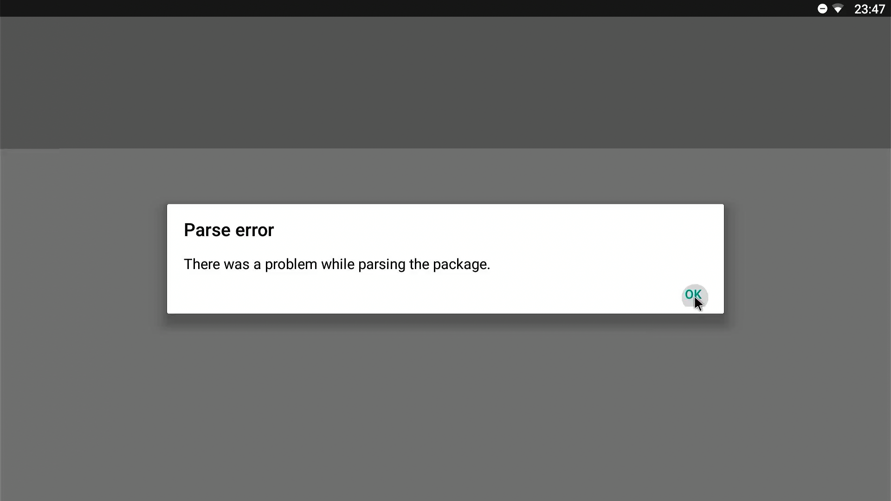
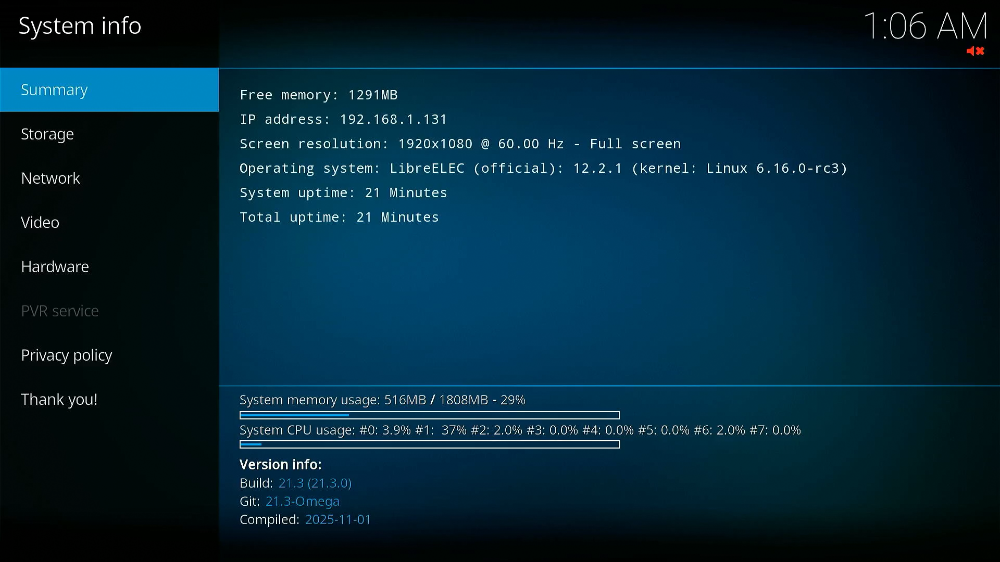
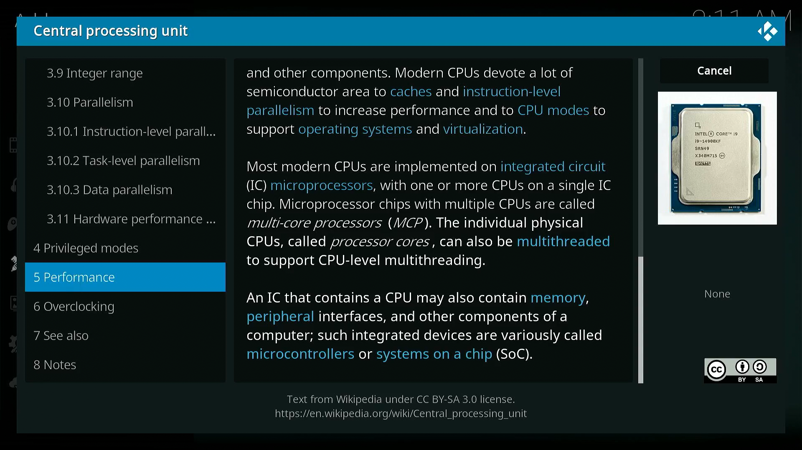

# Android TV Box to Linux appliance

## Introduction and why bother

There is a high chance that the person reading this has bought in the past one of those cheap android boxes to transform a television into a "smart" television, making it possible to watch more than cable channels. After the initial excitement, it might have gotten retired for being too cumbersome to use, low power or simply unsupported by every app after a while. What if you could save it from being E-waste?

## Credits & inspiration

The idea to look for my dusty android box came after watching the video [Linux on a TV Box - Raspberry Pi Alternative?](https://www.youtube.com/watch?v=b1UIIlYLM4I) from [TheSillyWorkshop](https://www.youtube.com/@TheSillyWorkshop) a few months ago. This seemed like something right up my alley, since I hate having devices that me or my family bought to be used once and forgotten.

With this in mind, I looked around for my TV Box, noted the model name and went online finding out if anyone had already had installed an alternative OS to the thing. That's when I found the [Turning an Amlogic S912 Android TV Box Into a Linux Appliance](https://sigmdel.ca/michel/ha/aml912/linux_on_aml912_en.html) blog post from [sigmdel.ca/michel](sigmdel.ca/michel), which was really useful during this whole experience. I would recomend to everyone to have a look at the blog since there are topics like networking, microcontroller reviews or other linux boxes examples.

## The box itself

My former Android box is the **Beelink GT 1**, adquired around 2017. The thing never had much use, outside of a few streaming sessions and it was quickly forgotten. It came with an IR transmitter controller and a 10 Watts (5V, 2A) rated power brick, with a barrel connector to the box. As for internal specifications:

|  Specifications  | Beelink GT1                |
|      :---        |      :---:                 |
| OS               | Android 6.0.1              |
| Kernel           | 3.14.29                    |
| CPU              | Amlogic S912               |
| GPU              | Mali-T820                  |
| RAM              | 2 GB                       |
| Storage (eMMC)   | 16 GB                      |
| Storage (microSD)| 512 GB Max.                |
| Ethernet         | Gigabit LAN                |
| Wireless         | Wi-Fi AC and BT4.0         |
| Video out        | HDMI 2.0                   |
| USB              | 2 x USB 2.0                |
| Power            | 10 Watts (5V, 2A)          |

### "Out-of-the-box" experience

Originally, it came with Android 6 with a sort of TV launcher pre-configured (maybe Android TV?) but after so many years, using it is very anoying since software is not supported and even using a third-party app store like [Aurora Store](https://auroraoss.com/) results in downloading uncompatible app packages. The most luck I have had was downloading though the [F-droid](https://f-droid.org/) webpage directly, for example [CPU Info](https://f-droid.org/en/packages/com.kgurgul.cpuinfo/). I tried downloading apps such as Grayjay for the  architecture of the Beelink GT1 but I got met with "Parse error", and Newpipe got me a "App not installed" message after installation. Furthermore, the web version of youtube is not supported on the default browser, and I was not able to install a new one. What a nightmare!

## Other OS

Luckily, during my research I found out there are people out there that had installed other OS to this box. Sometimes it's just a new ROM to have an updated version of AndroidTV (like on [this post from XDA Forums](https://xdaforums.com/t/beelink-gt1-original-2gb-ram-16gb-storage-android-tv-and-results-with-other-roms-slimboxtv-aidan-daivietpda.4733208/)), but other times is a full Linux system (found a [video installing Linux with a desktop environment](https://www.youtube.com/watch?v=k4qzfOOPbYA) on a TV box with the same SoC). 

Among these OS were **Libreelec**, a media player focused OS and **Armbian** (Linux for ARM development boards but with unofficial support for other boards like TV boxes).

### Libreelec

The first OS that I tried to use on the Beelink GT1 was Libreelec, which according to its wiki page identifies itself as:
> (...) a minimalist 'Just enough OS' Linux distribution for running Kodi

This seemed like a nice way to use the TV box, since initialy I didn't want to change it's function, and so I wanted to have it connected to the TV and be a media box.

#### Instalation

For installation, I just followed the [official instructions from the wiki](https://wiki.libreelec.tv/hardware/amlogic) and adapted them to my board/TV box.
At the time, I think I successfully used the dtb for GT1 Ultimate, since the only difference is the RAM and EMMC size.

I then installed the image into an USB drive with 32GB and pressed the reset button accessible underside of the case of the Beelink GT1. I actually removed it from the case to access this button easier.

After connecting power while having the reset button pressed, the system turned on and booted from USB (I used the back USB connector) with success into Libreelec boot screen.

#### Usage

However, it seems that most of my excitement was quickly shut down when I realized there were few apps (plugins) that I was interested in and that actually worked. Youtube plugins require a key linked to an youtube account to use them (which I was not interested in) and I found the interface hard to navigate and not as enjoyable to use, since everything felt slow.

Some other video providers (LBRY or Peertube) worked with their plugins but there was constant loading during browsing. Even worse, the content had some weird/suggestive NSFW thumbnails with unrelated titles for some videos, which I found repulsing.

Some instances of Peertube had linux content, even from creators I follow in Youtube, and seem ok in terms of content, but the loading and seeking ahead in the video would get stuck in a single frame and not load even after some minutes of waiting.

I also experimented with TV channels, but the most I was able to do was watch a Demo TV channel, which played a Big Buck Bunny video, and while it was smooth while playing it was getting constantly interrupted to buffer (network or video processing?).

Aside from video, I experimented with other plugins just for curiosity and found a terrible way to read wikipedia articles via its plugin:

Finally, I found that Libreelec was not for me and it was time to move on.

### Armbian

At the time, I was thinking that Armbian would be the last opportunity to have the TV box do something useful. It could be used as a simple file server or DNS ad-blocker, and probably pretty efficient.

For trying out Armbian, I was guided by the following pages:
- [sigmdel.ca/michel: linux on aml912](https://sigmdel.ca/michel/ha/aml912/linux_on_aml912_en.html#hardware)
- [i12bretro: Installing Armbian on Amlogic S912 Android TV Box (Tanix TX9s)](https://i12bretro.github.io/tutorials/0094.html)
- [Armbian forum:  Installation Instructions for TV Boxes with Amlogic CPUs](https://forum.armbian.com/topic/33676-installation-instructions-for-tv-boxes-with-amlogic-cpus)

#### USB booting

TODO

#### Installing to internal storage

TODO

#### General use

TODO

#### Benchmarks

TODO