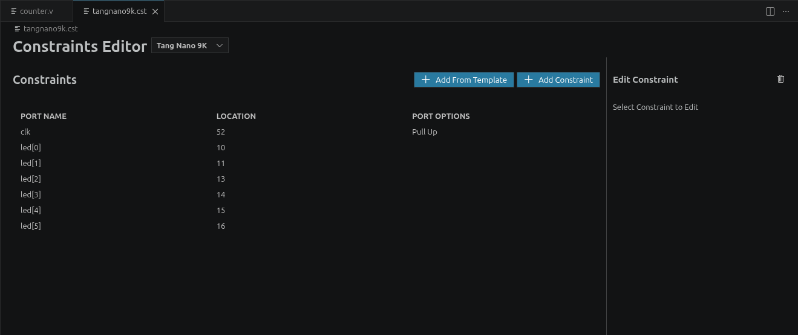

# Open-source FPGA toolchain

There are a lot of FPGAs out there, and many of them have amazing comunities, not as big or as talked as the SBC or  microcontrollers comunities, but really passionate and always able to find a way to use their hardware in a more open way. This time I decided to take a look at what was available for my FPGA board.

## Why

I picked up my Sipeed Tang Nano 9K FPGA and was setting up the proprietary IDE from Gowin in Linux, when I [ran into some problems](https://www.reddit.com/r/GowinFPGA/comments/1jlsbn8/gowin_ide_education_v191101_broken_on_linux/), some of them I fixed easily (packages not installed on my system), and others that required a bit more thinkering and browsing. In the end, I could not lauch the Constraints editor, and the FPGA Programmer was also a bit temperamental.

So it was time for open-source.

## Instalation

I followed the guide from [Lushay Labs - Tang Nano 9K: Getting Setup](https://learn.lushaylabs.com/getting-setup-with-the-tang-nano-9k/) which consists in a development setup based around VS Code.

Basically, after installing VS Code, the extension/plugin "Lushay Code" is responsible for hooking up VS Code to the actual open-source FPGA toolchain used to synthetise the bitstream for the FPGA in question. It also recommends the instalation of a HDL syntax highlighter and WaveTrace, a plugin for built in waveform viewing for debug.

The most important part of the puzzle is the [OSS-Cad-Suite](https://github.com/YosysHQ/oss-cad-suite-build/). This will be our toolchain to do synthesis of the FPGA program. It can simply be downloaded from the releases page of github and extracted to a known folder.

In VS Code, after installing the "Lushay Code" plugin, I was presented with the bottom right "FPGA Toolchain" which allowed me to link the path that I downloaded and extracted the OSS-Cad-Suite to.

## Usage

Now, we simply test it out by starting a VS Code project (that is to say, create a folder) and add a verilog `.v` file as well as a constraints file `tangnano9k.cst`.

Following a simple binary counter using the on-board LEDs, I copied the following verilog code:

    module top
    (
        input clk,
        output [5:0] led
    );

    localparam WAIT_TIME = 13500000;
    reg [5:0] ledCounter = 0;
    reg [23:0] clockCounter = 0;

    always @(posedge clk) begin
        clockCounter <= clockCounter + 1;
        if (clockCounter == WAIT_TIME) begin
            clockCounter <= 0;
            ledCounter <= ledCounter + 1;
        end
    end

    assign led = ledCounter;
    endmodule

For the constraint file, we can fill manually the constraits using the editor from "Lushay Labs" or just copy the text contents:

    IO_LOC "clk" 52;
    IO_PORT "clk" PULL_MODE=UP;
    IO_LOC "led[0]" 10;
    IO_LOC "led[1]" 11;
    IO_LOC "led[2]" 13;
    IO_LOC "led[3]" 14;
    IO_LOC "led[4]" 15;
    IO_LOC "led[5]" 16;

After this, we need to see it there is any problem with the routing or logic of our "program". To build it, simply click on the "FPGA Toolchain" button and choose "Build only".

After a while, if everything went right, the output panel will show "Toolchain Completed", with all substeps completing sucessfully along with a new file ending in a `.fs` extention. This is the generated bitstream.

After this, we can upload the bitstream to our Hardware. This could be done using the "Build and Program" command from the plugin, but it requires running a script to run openFPGALoader without being root. Because of this, I will be manually running openFPGALoader in the terminal.

If you hadn't, install openFPGALoader first. I will be following the instructions from [Programming an FPGA with a FOSS toolchain](https://blog.peramid.es/posts/2024-10-19-fpga.html) only for this part.

There are basically 3 commands I will be using:

- `openFPGALoader --scan-usb`  
    This should list an FT2232 JTAG Debugger

- `openFPGALoader -b tangnano9k -f led.fs`  
    Uploads the bitstream to the flash memory (non-volatile memory) of FPGA board.

- `openFPGALoader -b tangnano9k led.fs`  
    Uploads the bitstream to the SRAM (volatile memory) of FPGA board.

### Conclusion

That is it! This was pretty easy to install, and aside from some limitations ([read someone's opinion in reddit here](https://www.reddit.com/r/FPGA/s/0h0KAwMhCb)) it is what I was looking for.

If you still want to use the Gowin IDE, have a look at [this blog post](https://nand2mario.github.io/posts/2024/tang_tips/).

I will mostly be using the following material to keep up my FPGA knowledge:

[https://wiki.sipeed.com/hardware/en/tang/Tang-Nano-9K/Nano-9K.html](https://wiki.sipeed.com/hardware/en/tang/Tang-Nano-9K/Nano-9K.html)
[https://github.com/sipeed/TangNano-9K-example/](https://github.com/sipeed/TangNano-9K-example/)
[https://github.com/BrunoLevy/learn-fpga](https://github.com/BrunoLevy/learn-fpga)